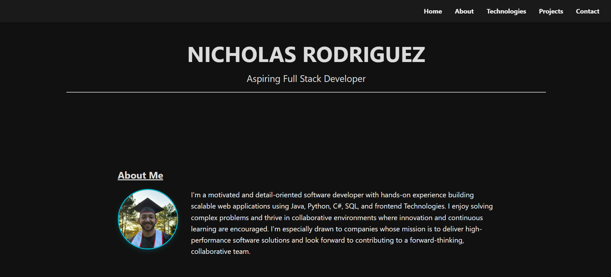

# Developer Portfolio

A single-page HTML/CSS/JS portfolio website showcasing my skills, projects, and contact information.

---

## 🌐 Live Demo

[View on GitHub Pages](https://nrodriguez20.github.io/PortfolioSite/)

---

## 🧰 Technologies Used

- HTML5
- CSS3 (including Flexbox/Grid)
- JavaScript (Vanilla)
- GitHub Pages (for free hosting)

---

## 📁 Sections Included

- **Home**
- **About**
- **Skills** – technologies and tools
- **Projects** – links to GitHub repos
- **Contact**

---

## 📸 Screenshots

### Home Page

---

## Getting Started

1. Clone the repo

git clone https://github.com/nrodriguez20/PortfolioSite.git
cd PortfolioSite

2. Open index.html in your browser.

3. To deploy:

- Push to GitHub
- Go to Settings → Pages → Source: main branch → root to enable GitHub Pages.

---

## Author

Nicholas Rodriguez

https://github.com/nrodriguez20
